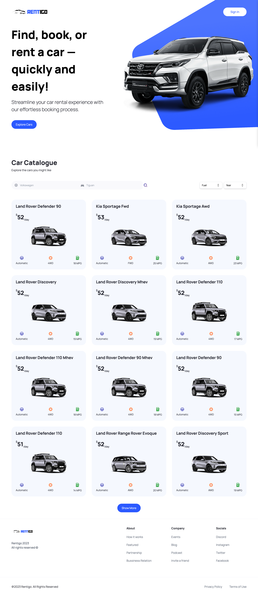

# Rentigo

Rentigo is a car rental web application created with Next.js. The web application provides an engaging platform for users to explore, filter, and get detailed views of various car models available for rent. Our mission is to facilitate an effortless car rental experience.

Rentigo integrates with the "Cars by API-Ninjas" third-party API to fetch and render the latest car data on the website, ensuring that users always have the most up-to-date information at their fingertips.



## Features

- Car Search: Users can explore the available cars using our search functionality. The initial search displays 12 cars, and users have the option to click on "Show More" to load 12 additional cars.

- Car Filters: Users can also filter cars based on the type of fuel and year of the car to streamline their search.

- Detailed Car Information: Each car card displays key information like the name, car model, transmission, drive and city miles per gallon (MPG).

- Expanded View: On hover, a "View More" button is displayed on the car card. Clicking on this button opens an expanded view of the car. The expanded view renders a nearly 360-degree view of the car using images from four different angles. It also provides more detailed information about the car, including vehicle class, combination MPG, number of cylinders, engine displacement, highway MPG, make, model, and year of production.

## Installation and Setup

To run this project locally, follow these steps:

1. Clone the repository:

```bash
git clone https://github.com/yourusername/Rentigo.git
```

2. Change your directory:

```bash
cd Rentigo
```

3. Install dependencies:

```
npm install
```

4. Start the server:

```
npm run dev
```

5. Open your browser and visit: http://localhost:3000

## Contact

For any questions or suggestions, please feel free to contact me.
